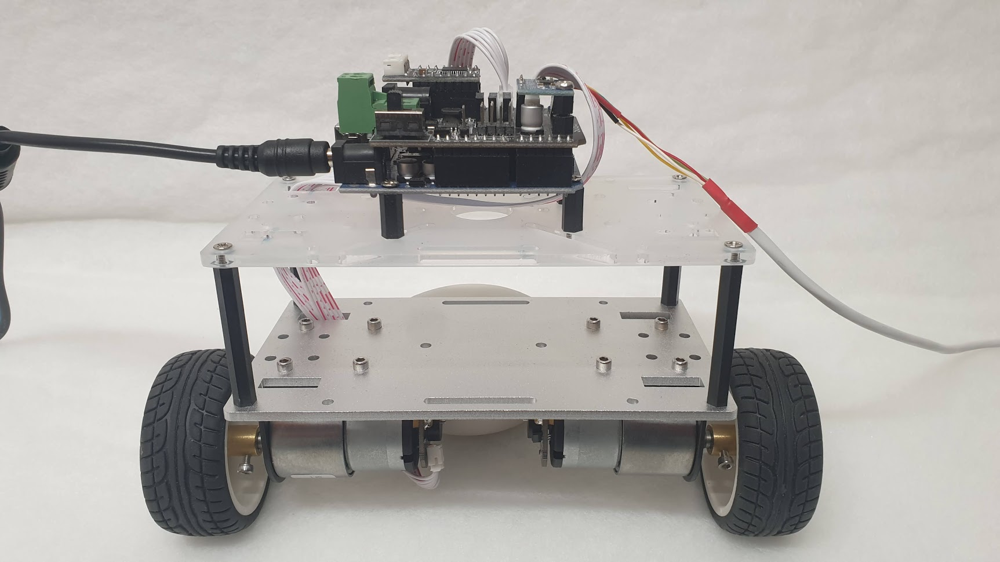
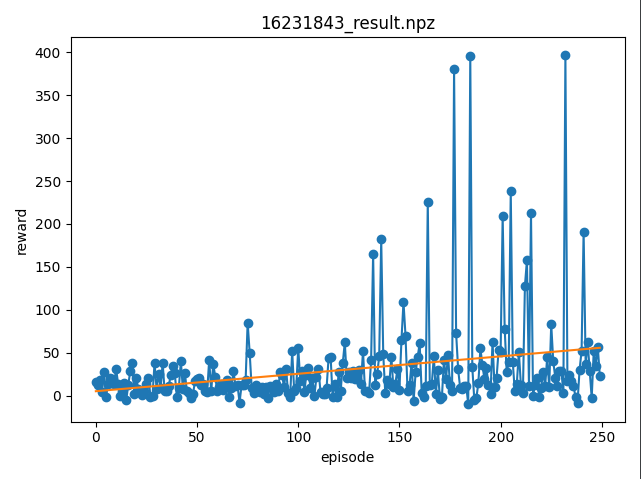

# Self-balancing robot
> Q-learning + Arduino Uno based robot


The aim of this project was to create model using Reinforced Machine learning,
that is able to keep uniaxial robot balanced. 


Project uses communication interface cloned from [repository](https://github.com/kwanty/selfbalancing-ml).

Robot (figure below) is a physical uniaxial scooter, with Arudino Uno microcontroller and shield.
Communication is carried by a serial port emulated with USB adapter.
Robot sends periodically information from its onboard gyroscope and accelerometer. 
As a response, agent can through serial port can set rotation speed of wheels.

<figure>


<figcaption align = "center">
<b>Fig.1 Robot (credits github.com/kwanty)</b></figcaption>
</figure>


## Project structure 

Project consists of three major parts: 
- ML 
- firmware (cloned)
- communication interface (cloned)

Firmware (`/firmware`) and communication interface (`/sbr-qt` and `sbr-py/util`) 
is part of another [repository](https://github.com/kwanty/selfbalancing-ml), 
created along robot.
Machine learning part can be found in `/sbr-py/ml`.

### ML 
All ML classes can be found inside `/sbr-py/ml/source` directory.
Agent class `RobotModel` used by ML is declared in `TF_interface.py`. 
It can communicate with robot using `RobotInterface` class defined in `robot_interface.py`.
`QModel` defines policy and other methods used in Q-learning. 

Core methods used to learn model are defined in `/sbr-py/ml/tests/test_robot_model.py`:
- `test_model_qlearn_real()` learns in `n_episodes` and saves results inside `./tmp`.
- `test_load_qlearn_real()` loads saved results and continues learning until `n_episodes`.

## Results

We selected Q-learning as a learning technique used in this project.
The main benefits of this approach were: 
- simplicity of usage
- relatively short time to learn 

Based on used reward and policy, very different results were obtained. 
Reward used to obtain the final results was:

%20-%20s(n-1))%20-%20%5Cleft%20%5Clfloor%20%7Be%7D%5E%7Bs(n)/10%7D%20%5Cright%20%5Crfloor%20&plus;%204*%20%5Cleft%20%5Clfloor%20%5CDelta%20t%20%5Cright%20%5Crfloor%20)

where `s()` is swing as function of step,
`n` is current step,
`delta t` is time measured from start of the episode.

Chart below presents reward over episodes. 
The bigger a reward was the longer robot would balance on its own.




## Usage
Code was tested on Python 3.8. 

### Learning 
After installing all necessary python modules navigate to
```bash
cd ./sbr-py/ml/tests
```
and run `test_model_qlearn_real()` method defined 
inside `test_robot_model.py` by
```bash
python test_robot_model.py TestRobotInterface.test_model_qlearn_real
```
Learning results is automatically saved inside `./tmp` directory.

### Continuing learning with saved model
In order to load result and continue learning: 
1) set appropriate `n_episodes`
2) change input filename 
3) run
```bash
python test_robot_model.py TestRobotInterface.test_load_qlearn_real
```

### Plotting results 
To plot obtained result navigate to `/sbr-py/util`, change input filename 
and run
```bash
python plot.py test_plot_reward
```